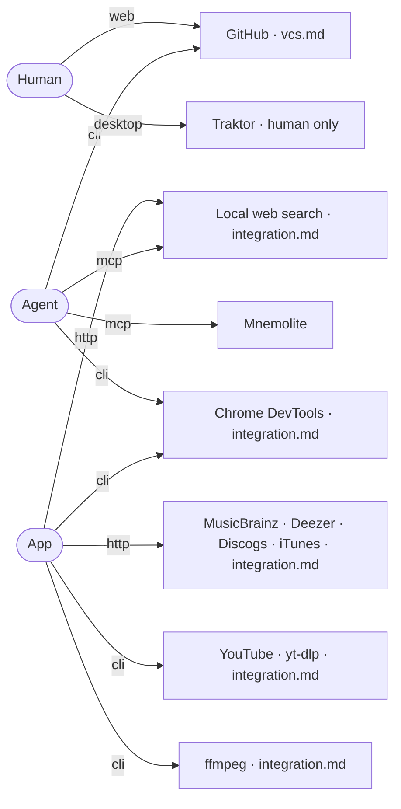

# Ecosystem

```mermaid
flowchart LR
  Human([Human])
  Agent([Agent])
  App([App])
  Vcs["GitHub · vcs.md"]
  Search["Local web search · integration.md"]
  Providers["MusicBrainz · Deezer · Discogs · iTunes · integration.md"]
  Yt["YouTube · yt-dlp · integration.md"]
  Chrome["Chrome DevTools · integration.md"]
  Ffmpeg["ffmpeg · integration.md"]
  Traktor["Traktor · human only"]
  Memory["Mnemolite"]

  Agent -- cli --> Vcs
  Human -- web --> Vcs
  Agent -- mcp --> Search
  App -- http --> Search
  App -- http --> Providers
  App -- cli --> Yt
  App -- cli --> Chrome
  Agent -- cli --> Chrome
  App -- cli --> Ffmpeg
  Human -- desktop --> Traktor
  Agent -- mcp --> Memory
```
